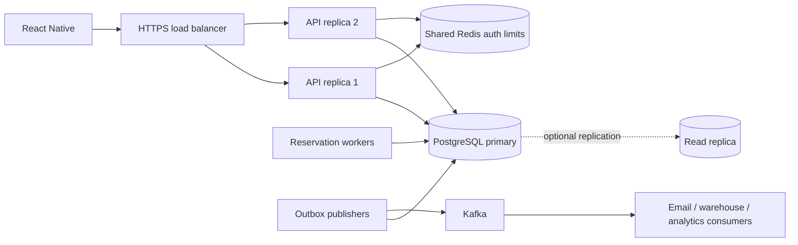

# From a local API to an operated service

[Root](../README.md) · [Events](EVENTS.md) · [Configuration](CONFIGURATION.md)

## Architecture and scaling



The backend is a **modular monolith**: one deployable API, organized into business domains. It is easier to understand and keeps checkout transactional. More API replicas serve the same database, Redis and signing keys. Authentication reloads session/account permissions from the primary on each request, so revocation works across replicas. No sticky sessions are required. Redis auth limits are shared across replicas.

One Uvicorn process runs in each container. Scale container count first. Each process has its own database pool; budget connections as approximately `replicas × (DB_POOL_SIZE + DB_MAX_OVERFLOW)` plus workers, migrations and administration. A larger pool is not automatically faster. Load-test before increasing replicas or changing pool settings. Use bounded connection queues and monitor p95/p99 latency, error rate, lock waits and database saturation.

The inherited database code includes read-replica plumbing, but active API dependencies deliberately use the primary to avoid stale ownership/auth/checkout results. Add a marketplace-scoped read session explicitly when moving aggregate reports to a replica, and document replication lag. Do not route authentication or recent order reads to a replica blindly. Schema-per-tenant helpers remain only as template references; sellers are ownership-scoped records in the shared marketplace schema.

## Local load-balancing lab

```bash
export LOCAL_UID=$(id -u)
export LOCAL_GID=$(id -g)
docker compose -f docker-compose.yml -f docker-compose.balance.yml up --build -d
curl http://localhost:8080/api/v1/health
```

[Nginx configuration](../deploy/nginx/nginx.conf) uses least-connections routing to `app` and `app2`. The app port 8000 remains for direct debugging; the proxy listens on 8080. The override removes the second app's published port using Compose's [reset merge behavior](https://docs.docker.com/reference/compose-file/merge/). Use Compose 2.24.4+.

The API does not trust arbitrary `X-Forwarded-For` headers. The local proxy therefore shares an upstream auth-rate-limit bucket per proxy address, which can be restrictive for many users. Nginx separately limits by the connecting client's IP. For production, configure a verified trusted proxy chain and edge rate limits; accept forwarding headers only from known load-balancer addresses. Never set unrestricted proxy trust on an API reachable directly by clients.

## Example server deployment sequence

1. Provision a staging environment: container host/orchestrator, managed PostgreSQL, managed Redis, private networking, DNS and HTTPS load balancer. Decide region, availability and recovery objectives before production. Keep database, Redis and broker ports private.
2. Build the reviewed commit: `docker build -t marketplace:<commit> .`. Push that image to your chosen registry using its authenticated CLI, then deploy that exact tag/digest on your server. Do not bake `.env` or keys into an image; `.dockerignore` excludes them. Docker runs as an unprivileged user by default.
3. Inject secrets using the platform's secret store: database credentials, signing keys and eventual provider credentials. Mount keys read-only at configured paths with permissions readable by the runtime user. Generate production keys separately from demo keys; plan key-ID based rotation before distributing long-lived clients.
4. Configure explicit `ALLOWED_HOSTS`, browser origins if needed, `APP_DEBUG=false`, `APP_ENV=production`, `LOCAL_PAYMENTS_ENABLED=false`, `LOCAL_EMAIL_TOKENS_ENABLED=false`, and `RATE_LIMIT_ENABLED=true`. Production validation rejects local adapters. The current project then has **no live payment or email delivery capability** until those integrations are added.
5. Run one migration job using the same image and configuration: `alembic upgrade head`. Use a dedicated migration database role with DDL permission. Give the API role only the DML privileges it needs. Do not run concurrent migrations from every API replica.
6. Start at least two API replicas behind HTTPS, plus the reservation worker. Add outbox publishers with a secured broker after extending the local Kafka client settings. Configure liveness `/api/v1/health` and readiness `/api/v1/ready`; readiness currently verifies PostgreSQL only. Redis is required for auth, so add Redis monitoring and a dependency-aware readiness policy for your deployment.
7. Provision staff with `python scripts/create_staff.py --email ... --name ... --role admin`. The password is prompted, not passed on the command line. Do not run the local demo seed against production or promote a database containing public demo credentials.
8. Smoke-test registration/login, permissions, cart/checkout, provider webhook delivery, expiry and refunds in staging. Test backup restore and graceful termination, then deploy with a rolling strategy and monitor.

Example environment values are in [.env.example](../.env.example); they are local development values, not a production secret template. The included Compose files are local labs, not a high-availability server installation.

## Before real commerce

| Area | Included | Still required for a real deployment |
|---|---|---|
| Payments | Deterministic local capture/refund, transaction journal | Live provider, signed/deduplicated webhooks, reconciliation, late-payment recovery, chargebacks |
| Seller money | Commission snapshots and manual settlement records | Seller identity/onboarding obligations, provider payouts, failed-transfer recovery, accounting integration |
| Tax/shipping | Product subtotal, address snapshot, tracking entry | Tax and shipping quotes, address validation, carrier integration, refund allocation |
| Email | Local verification/reset tokens | Email transport, delivery retries, template links and token redaction, anti-enumeration behavior |
| Access | Argon2 passwords, RSA JWTs, session revocation, role/ownership checks | Staff MFA/SSO policy, key rotation, account recovery and operational access reviews |
| Operations | Docker, migrations, logs, health, metrics, tests | Staging, load tests, backups/PITR and restore drills, alerts, incident response, secret rotation |
| Events | Durable transactional outbox and retrying publisher | Authenticated broker, consumer deduplication, DLQ/retention policy, lag alerts |

## Migrations, rollout and recovery

Alembic's initial revision is frozen DDL, not a call to today's model metadata. Add a new revision for future changes. `uv run alembic revision --autogenerate -m "add product brand"` proposes a migration; inspect it. Autogeneration cannot infer every rename or data migration.

Use expand/contract changes for rolling deployments: add a nullable column, deploy compatible readers/writers, backfill, then enforce constraints in a later deployment. Back up before risky data changes. `alembic downgrade -1` reverses the initial schema by dropping its tables; that destroys their contents. A downgrade is not a backup or a universal production rollback strategy.

Configure PostgreSQL backups and point-in-time recovery, document retention, and test restoring to a separate environment. Set recovery point/time objectives (RPO/RTO). Restrict audit-log update/delete privileges and define data retention/deletion requirements; the API exposes no audit mutation endpoint, but database administrators can still change rows.

## Observability

Prometheus: `http://localhost:9090`, API metrics: `/metrics`. Keep metrics behind private networking or an authenticated monitoring gateway; the demo Nginx blocks its public path. Correlation IDs are generated by the server and included in response headers and structured logs. Never add passwords, access/refresh tokens, full addresses, or payment credentials to logs.

Jaeger: `http://localhost:16686`. For host testing set `APP_ENV=dev` and `OTLP_ENDPOINT=http://localhost:4317`. Compose already sets the container endpoint to `http://jaeger:4317`; override `DOCKER_OTLP_ENDPOINT` for a different collector. Set `APP_ENV=dev` in `.env` and recreate the API to enable export. Non-local environments disable the local payment endpoint. Trace export is optional and asynchronous; it should not determine whether an order commits. See the [Docker command guide](DOCKER.md).

Alert on request error rate/latency, failed auth spikes, PostgreSQL pool/lock saturation, pending reservation age, outbox backlog, Kafka consumer lag and backup failures. `/health` only means the process can answer; `/ready` currently means it can reach PostgreSQL. Neither proves that a payment provider or warehouse is healthy.
