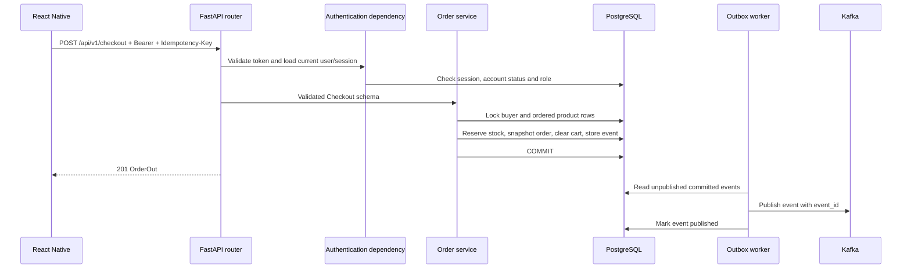

# Follow an order from the phone to PostgreSQL

[Code index](CODE_INDEX.md) · [API reference](API_REFERENCE.md) · [Glossary](GLOSSARY.md)

## Request path

Entry point: [main.py](../src/app/main.py) installs middleware and the [versioned router](../src/app/api/v1/router.py). The router includes [orders/router.py](../src/app/domains/orders/router.py). FastAPI parses the JSON with [Checkout](../src/app/domains/orders/schemas.py) and resolves the `Buyer` dependency in [api/deps.py](../src/app/api/deps.py). This is dependency injection: FastAPI supplies the database session and authenticated actor instead of the handler constructing them itself.

[orders/service.py](../src/app/domains/orders/service.py) validates currency, locks the buyer record, and checks whether this buyer already used the idempotency key. It compares the original request hash on a retry. Then it reads the buyer's address, locks product rows in a consistent order, checks stock and seller availability, and snapshots product names, prices, commission and shipping address. The total must match `expected_total_minor`, which prevents silently charging a changed price.

All changes share one [database session](../src/app/db/session.py). An exception rolls the transaction back. The [outbox event](../src/app/domains/events/service.py) is inserted before the same commit, so an order cannot commit while its event disappears. The event contains identifiers and amounts, not the shipping address or credentials.

An order reserves inventory for 30 minutes by default. [reservations.py](../src/app/workers/reservations.py) cancels expired pending orders and restores stock. Payment, cancellation and expiry all lock the order before changing state, preventing double restocking. Kafka is independent of the API response; [outbox.py](../src/app/workers/outbox.py) retries after broker failures.

## Manual API journey

Use `/docs` and authorize with the relevant role's access token.

1. Buyer: `GET /products`, `GET /addresses`, then `PUT /cart/items/{product_id}` with `{"quantity":1}`.
2. Buyer: `POST /checkout`, with header `Idempotency-Key: checkout-demo-001` and body `{"address_id":"<address UUID>","currency":"USD","expected_total_minor":1999}`. Use the actual product price. Retry exactly the same request to see the same order ID. For a new purchase use a new key.
3. Buyer: `POST /orders/{order_id}/payments/local`. This simulates capture; no money moves.
4. Seller: `GET /seller/fulfillments`. For each item owned by that seller, `POST /seller/fulfillments/{item_id}` with `{"status":"shipped","tracking_number":"TRACK-001"}`, then with `"status":"delivered"` and the same tracking number. In a real system a carrier integration should confirm delivery.
5. Buyer: submit a review at `POST /products/{product_id}/reviews`; request a return at `POST /orders/{order_id}/returns` with a reason. All items must have been delivered within the previous 14 days. This reference implements full-order returns.
6. Finance: `GET /finance/returns`; after verifying all returned goods arrived, `POST /finance/orders/{order_id}/refund/local` with `{"goods_received":true,"reason":"All goods received and inspected"}`. The full refund restores stock once and adds a negative ledger entry.
7. Analytics: inspect `/analytics/sales`, `/analytics/products`, `/analytics/sellers`. Refunded orders are excluded from current paid-sales totals. This is a current-state report, not a historical revenue recognition report.
8. Admin: inspect `/admin/audit`. Events and audit records are written together with business changes.

For seller settlement, wait until all order items are delivered and the 14-day return window has closed. Finance records an already completed external bank transfer with `/finance/orders/{order_id}/settlements`, seller ID and unique reference. It rejects an open return or duplicate transfer reference. Do not use this endpoint to initiate money movement.

## Error handling

Business errors use `{"error":{"code":"CONFLICT","message":"...","details":[]}}`. Invalid request schemas use FastAPI's `422` response. `401` means credentials/session failed, `403` means the role lacks permission, `404` also hides another buyer's resource, and `409` means the request conflicts with current state. A server-generated `X-Correlation-ID` connects a response to logs.

The original `domains/example` is retained as an unmounted minimal teaching reference. Its generic optimistic version example is not the marketplace's concurrency implementation; the active catalog uses a row lock plus version check.
